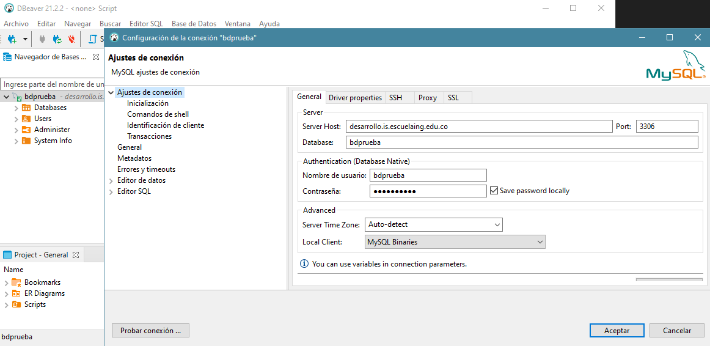
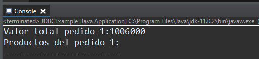
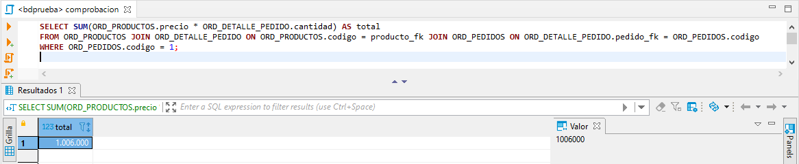
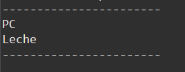
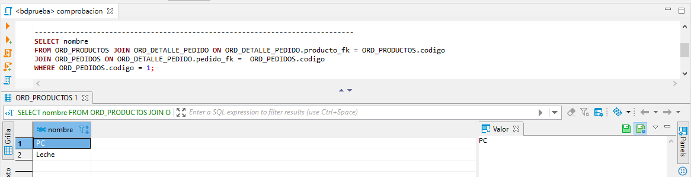
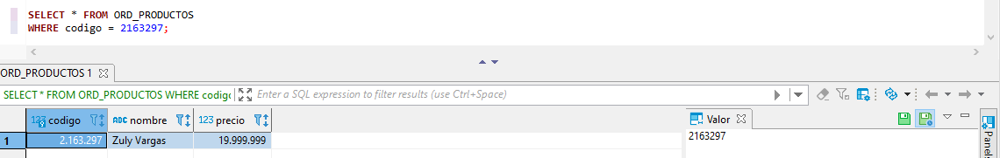

### Escuela Colombiana de Ingeniería
### Ciclos de Vida del desarrollo de Software – CVDS
#### LABORATORIO 7: Tecnologías de persistencia - Frameworks de Persistencia - Introducción a MyBatis

Camilo Andrés Pichimata Cárdenas

Zuly Valentina Vargas Ramirez

## SECCIÓN I. - INTRODUCCIÓN A JDBC

Datos de conexión:

    Url: jdbc:mysql://desarrollo.is.escuelaing.edu.co:3306/bdprueba

    Driver: com.mysql.jdbc.Driver

    Usuario: bdprueba

    Contraseña: prueba2019

_Verifique por medio de un cliente SQL, que la información retornada por el programa coincide con la que se encuentra almacenada en base de datos:_

Para comparar los resultados se realizó la conexión a la base de datos bdprueba 
mediante DBeaver :

1. Comprobación de valorTotalPedido( ) :

Sentencia SQL : 

`
"SELECT SUM(ORD_PRODUCTOS.precio * ORD_DETALLE_PEDIDO.cantidad) AS total FROM ORD_PRODUCTOS JOIN ORD_DETALLE_PEDIDO ON ORD_PRODUCTOS.codigo = producto_fk JOIN ORD_PEDIDOS ON ORD_DETALLE_PEDIDO.pedido_fk = ORD_PEDIDOS.codigo WHERE ORD_PEDIDOS.codigo = " + Integer.toString(codigoPedido); `

+ Resultado obtenido con el método implementado:

 

Confirmación del resultado:

 

2. Comprobación de nombresProductosPedido( ) :

Sentencia SQL : 

`
"SELECT nombre FROM ORD_PRODUCTOS JOIN ORD_DETALLE_PEDIDO ON ORD_DETALLE_PEDIDO.producto_fk = ORD_PRODUCTOS.codigo JOIN ORD_PEDIDOS ON ORD_DETALLE_PEDIDO.pedido_fk =  ORD_PEDIDOS.codigo WHERE ORD_PEDIDOS.codigo = " + Integer.toString(codigoPedido); 
`

+ Resultado obtenido con el método implementado:

Confirmación del resultado:

3. Comprobación de nombresProductosPedido( ):

Sentencia SQL : 

`
"INSERT INTO ORD_PRODUCTOS(codigo,nombre,precio) VALUES(" + Integer.toString(codigo) +", '"+ nombre + "',"+ precio + ")";
`

## SECCIÓN II. - INTRODUCCIÓN A MYBATIS

