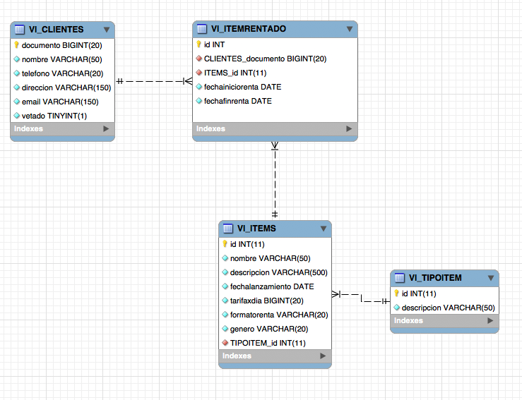

### Escuela Colombiana de Ingeniería
### Ciclos de Vida del desarrollo de Software – CVDS
#### LABORATORIO 8: INTEGRACIÓN DE CAPAS CON GOOGLE GUICE

Camilo Andrés Pichimata Cárdenas

Zuly Valentina Vargas Ramirez

  

## PARTE I. INICIO EN CLASE

A continuación la estructura del proyecto con las clases añadidas en la parte I

    │   .classpath
    │   .gitignore
    │   .project
    │   nb-configuration.xml
    │   pom.xml
    │   README.md
    │   samples_mybatis-guice.iml
    │   tables.sql
    │
    ├───.settings
    │       org.eclipse.core.resources.prefs
    │       org.eclipse.jdt.core.prefs
    │
    ├───img
    │       cmodel.png
    │       model.png
    │
    ├───src
    │   └───main
    │       │   .DS_Store
    │       │
    │       ├───java
    │       │   └───edu
    │       │       └───eci
    │       │           └───cvds
    │       │               ├───sampleprj
    │       │               │   ├───dao
    │       │               │   │   │   ClienteDAO.java
    │       │               │   │   │   ItemDAO.java
    │       │               │   │   │   PersistenceException.java
    │       │               │   │   │   TipoItemDAO.java
    │       │               │   │   │
    │       │               │   │   └───mybatis
    │       │               │   │       │   MyBATISClienteDAO.java
    │       │               │   │       │   MyBATISItemDAO.java
    │       │               │   │       │   MyBATISTipoItemDAO.java
    │       │               │   │       │   XXClienteDAO.java
    │       │               │   │       │   XXItemDAO.java
    │       │               │   │       │
    │       │               │   │       └───mappers
    │       │               │   │               ClienteMapper.java
    │       │               │   │               ItemMapper.java
    │       │               │   │               TipoItemMapper.java
    │       │               │   │
    │       │               │   └───jdbc
    │       │               │       └───example
    │       │               │               JDBCExample.java
    │       │               │
    │       │               └───samples
    │       │                   ├───entities
    │       │                   │       Cliente.java
    │       │                   │       Item.java
    │       │                   │       ItemRentado.java
    │       │                   │       TipoItem.java
    │       │                   │
    │       │                   └───services
    │       │                       │   ExcepcionServiciosAlquiler.java
    │       │                       │   ServiciosAlquiler.java
    │       │                       │   ServiciosAlquilerFactory.java
    │       │                       │
    │       │                       ├───client
    │       │                       │       MyBatisExample.java
    │       │                       │
    │       │                       └───impl
    │       │                               ServiciosAlquilerImpl.java
    │       │                               ServiciosAlquilerItemsImpl.java
    │       │                               ServiciosAlquilerItemsStub.java
    │       │
    │       └───resources
    │           │   config.properties
    │           │   mybatis-config.xml
    │           │
    │           └───mappers
    │                   ClienteMapper.xml
    │                   ItemMapper.xml
    │                   TipoItemMapper.xml
    │
    └───target
        ├───classes
        │   │   config.properties
        │   │   mybatis-config.xml
        │   │
        │   ├───edu
        │   │   └───eci
        │   │       └───cvds
        │   │           ├───sampleprj
        │   │           │   ├───dao
        │   │           │   │   │   ClienteDAO.class
        │   │           │   │   │   ItemDAO.class
        │   │           │   │   │   PersistenceException.class
        │   │           │   │   │   TipoItemDAO.class
        │   │           │   │   │
        │   │           │   │   └───mybatis
        │   │           │   │       │   MyBATISClienteDAO.class
        │   │           │   │       │   MyBATISItemDAO.class
        │   │           │   │       │   MyBATISTipoItemDAO.class
        │   │           │   │       │   XXClienteDAO.class
        │   │           │   │       │   XXItemDAO.class
        │   │           │   │       │
        │   │           │   │       └───mappers
        │   │           │   │               ClienteMapper.class
        │   │           │   │               ItemMapper.class
        │   │           │   │               TipoItemMapper.class
        │   │           │   │
        │   │           │   └───jdbc
        │   │           │       └───example
        │   │           │               JDBCExample.class
        │   │           │
        │   │           └───samples
        │   │               ├───entities
        │   │               │       Cliente.class
        │   │               │       Item.class
        │   │               │       ItemRentado.class
        │   │               │       TipoItem.class
        │   │               │
        │   │               └───services
        │   │                   │   ExcepcionServiciosAlquiler.class
        │   │                   │   ServiciosAlquiler.class
        │   │                   │   ServiciosAlquilerFactory$1.class
        │   │                   │   ServiciosAlquilerFactory.class
        │   │                   │
        │   │                   ├───client
        │   │                   │       MyBatisExample.class
        │   │                   │
        │   │                   └───impl
        │   │                           ServiciosAlquilerImpl.class
        │   │                           ServiciosAlquilerItemsImpl.class
        │   │                           ServiciosAlquilerItemsStub.class
        │   │
        │   └───mappers
        │           ClienteMapper.xml
        │           ItemMapper.xml
        │           TipoItemMapper.xml
        │
        └───test-classes

### Configuración de la Inyección de dependencias

### Prueba consulta de usuario con ID 1

Ejecutamos el siguiente comando:

    mvn exec:java -Dexec.mainClass="edu.eci.cvds.samples.services.client.MyBatisExample"

Salida:

## PARTE II. PRUEBAS

Muestra de la ejecución de las pruebas construidas:

## PARTE III - CAPA PRESENTACIÓN

## PARTE IV - ENTREGA CONTINUA

